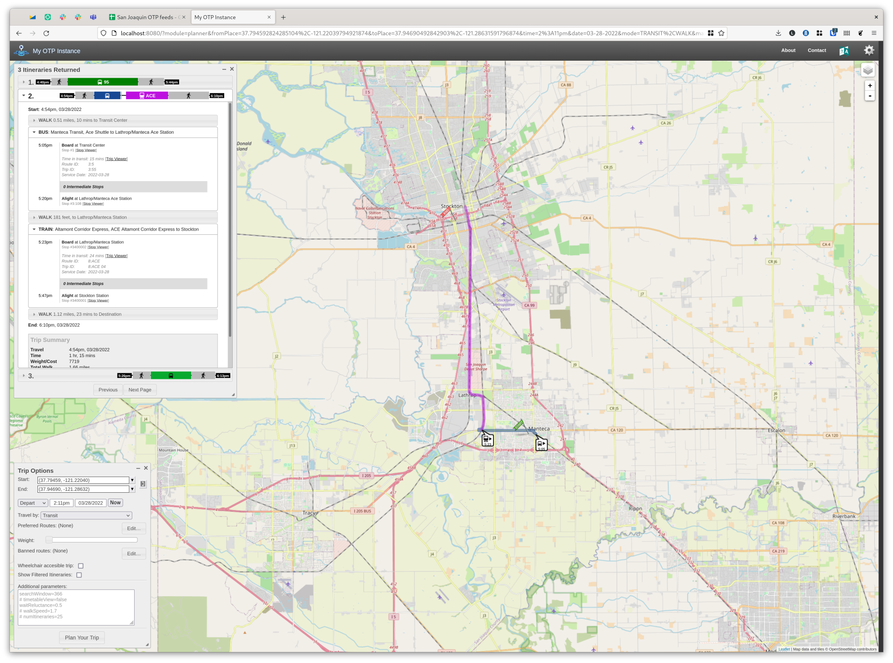

## OTP2 configuration for San Joaquin

This is a configuration repository for OTP2 for the region of San Joaquin.

It contains a Makefile for downloading all dependencies (OTP2, OSM, GTFS) and
configuration files tailored to the low-frequency services of the area.

### Prerequisites

In order to run the build script you need to install the following programs:

- make
- Java 17
- curl
- osmium

### Usage

To build a graph run the following command:

```
make build-graph
```

After the graph build has completed you can start the OTP instance with

```
make run
```

and open http://localhos:8080

### Screenshots



